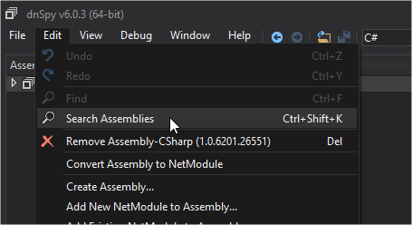
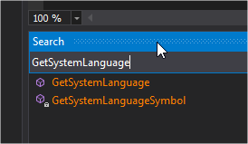
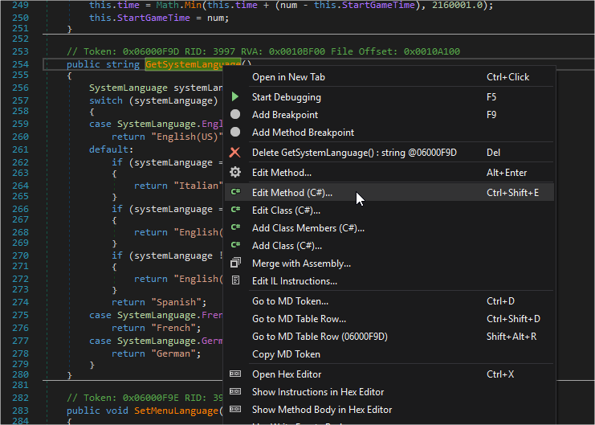
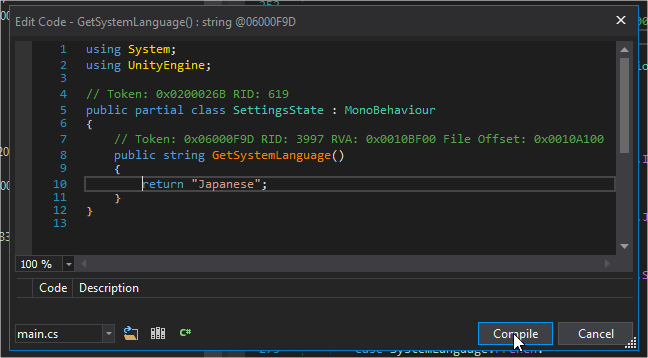
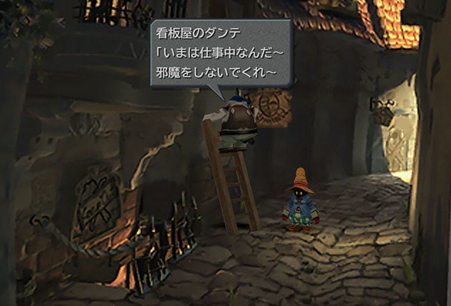

# Final Fantasy IX (Steam) Japanese

For some reason, even after you change the language options for Final Fantasy IX on Steam to Japanese, the game still plays out in English, despite all of the Japanese data being in the game. This was disappointing for me who likes to use these games as a practice tool.

Fortunately it was quite easy to modify the game's code to force the language into Japanese. There was already a patched version of the file floating around the forums, but I prefer to do it myself and know exactly what was changed, as well as knowing how to redo it in case the game gets an update in the future.

## Instructions

1) Open `Steam\steamapps\common\FINAL FANTASY IX\x64\FF9_Data\Managed\Assembly-CSharp.dll` with [dnSpy](https://github.com/0xd4d/dnSpy)

2) Using `Edit->Search Assemblies` search for `GetSystemLanguage` (which is a method inside the `SettingsState` class on the global namespace)




4) Double-click on the search result, then right-click on the method's name and choose `Edit Method (C#)...`



5) Replace all of the method's body with `return "Japanese";`

In other words, this:

```cs
public string GetSystemLanguage()
{
    SystemLanguage systemLanguage = Application.systemLanguage;
    switch (systemLanguage)
    {
    case SystemLanguage.English:
        return "English(US)";
    default:
        if (systemLanguage == SystemLanguage.Italian)
        {
            return "Italian";
        }
        if (systemLanguage == SystemLanguage.Japanese)
        {
            return "English(US)";
        }
        if (systemLanguage != SystemLanguage.Spanish)
        {
            return "English(US)";
        }
        return "Spanish";
    case SystemLanguage.French:
        return "French";
    case SystemLanguage.German:
        return "German";
    }
}
```

Becomes:

```cs
public string GetSystemLanguage()
{
    return "Japanese";
}
```

6) Hit `Compile`, then `File->Save Module` with the default settings, on top of the original file.



That's it! The game should now run in Japanese (don't be fooled by the title screen).



Note: If at any point you want to go back to the original language, just use Steam's built-in `Verify integrity of game files...` option. Or keep a backup of the original file yourself.
